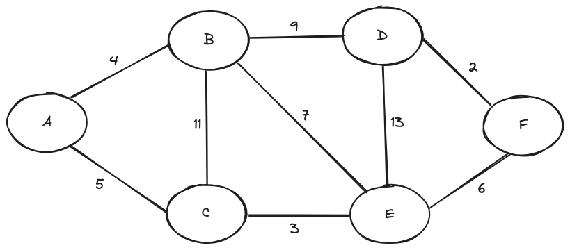
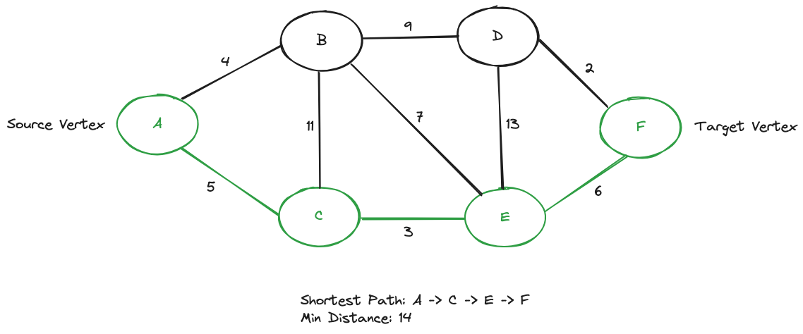

# Dijkstra's Algorithm Implementation

This repository contains a Python implementation of Dijkstra's algorithm for finding the single source shortest path in a graph. Additionally, it includes an example script demonstrating the usage of the algorithm.

## Files

- **dijkstra.py**: Contains the implementation of Dijkstra's algorithm, including classes for Vertex, Edge, and DijkstraAlgorithm.
- **example.py**: An example script demonstrating how to use the implemented algorithm to find the shortest path in a graph.

## Usage

To use the implementation, follow these steps:

1. Ensure you have Python installed on your system.
2. Import the necessary classes from `dijkstra.py` into your project.
3. Create Vertex and Edge objects to represent your graph.
4. Use the `DijkstraAlgorithm` class to calculate the shortest path between vertices.

## Example

```python
from dijkstra import Vertex, Edge, DijkstraAlgorithm

# Create vertices and edges (as demonstrated in example.py).

# Instantiate the DijkstraAlgorithm class.
dijkstra = DijkstraAlgorithm()

# Calculate the shortest path between two vertices.
shortest_path, min_distance = dijkstra.calculate_shortest_path(start_vertex, end_vertex)

print("Shortest Path:", shortest_path)
print("Minimum Distance:", min_distance)
```


## Visualization

Here is the visualization for the given graph in `example.py` and calculating the single source shortest path from Vertex `A` to Vertex `F`:
- **Undirected Graph** 
- **Dijkstra's Algorithm** 


